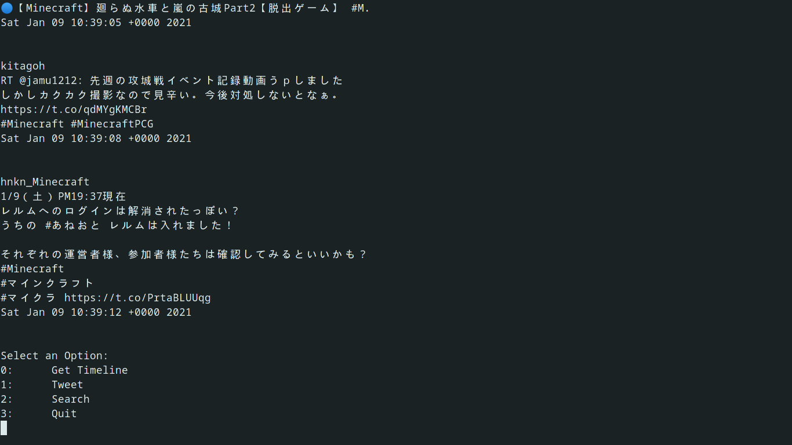

## Twitter CLI

This application is a command line interface in order to interact with twitter without having to use twitter. This is an extremely simple implementation of this idea and is written in python at the moment, if I decide that the app is not performant enough I will re-write this is go.

> what the program currently looks like

## Use

Inside of the config.yaml file put your consumer keys as well as your authentication tokens the program pulls these from the config.yaml file and initializes the api with those tokens.

Make sure that your program has Read and Write access otherwise you will not be able to tweet from the cli.

## TODO

- Abstract iterating through tweets
